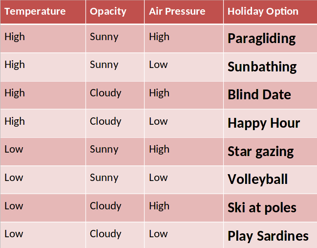

# Hitchhiker's guide to the Red Planet
## Overview
Imagine you are going to travel back in the past and go on holidays to Mars with a group of your friends.  You arrive on the Red Planet with your swimming togs and loads of sun cream, only to realise that everyone else is carrying skis and dressed in furs.  Most of your mates start laughing as it hits you that at certain times of the year the temperature on Mars can get as low as -35 degrees at the warmest part of the day.
As most of your mates are sniggering your best friend zips you a small command line app, and says "Next time you want to avoid a 40 month round trip to pick up your skis check this first".
You read your z-mail and find an app titled **Hitchhiker's guide to the Red Planet**

### Who is this app for?
This command line app is for all inter-galactic time-travelling tourists who wish to holiday on Mars at a specific date in the past.

### Where does the data come from?

This command line tool in python explores real-time data representing the weather conditions on Mars from Sol 1.  The data was measured and transmitted via the Rover Envionmental Monitoris Station (REMS) onboard the Curiosity Rover.  This data was made public by the NASA's Mars Science Laboratory and the Centro de Astrobiologia (CSIC-INTA).  
 
### What does it do?
 The environmental magnitudes given in this dataset are obtained from the values read by the Rover Environmental Monitoring Station (REMS) on board the Mars Science Laboratory (MSL) rover on mars.  This dataset provides the environmental magnitudes at REMS location, so MSL rover influences those magnitudes (rover position, rover temperature, rover orientation, rover shade, dust depositions on the rover, etc.)
 
This examines the data in a fictional response to creating a critical guide to hitch hiking on the Red Planet.  The aim is to interrogate the data and create the best possible outcomes to holidaying in Mars.  The reason this has been selected is to use something like NASA's data and interrogate the data set into meaningful information and creating actionable insights based upon this.
  
 
 ## How does it work
This a unique way of interpreting real world data using a command line interface in python.  This application will attempt to find out what holiday activities are best suited on the Red planet in a fictional sense.  It will give the applicable holiday activities for any given day according to the weather that is experienced on that particular day.  The aim is to interrogate the dataset and come up with the best laid plans for enjoying a holiday.  The simple command line interface is OS independent and not pertaining to any computer architecture and could be run in any environment. 

## Features
1. **Choose arrival date**
 

Our inter-galactic, time-travelling tourists are first asked to enter the date on which they will be starting their holiday.  For any holiday an arrival date is very important, but when you are travelling into the past its importance is heightened even more.  Without this feature the inter-galactic, time-travelling tourist would not be able to start their Martian holiday.

2. **Choose stay duration**

Second in importance only to the arrival date is the duration.  This is of great value to the inter-galactic, time-travelling tourist as it allows him/her/it to spend more than one day on the glorious red planet.  Every good holiday last for a few days or even a few weeks, so this feature is very important for ensuring that our inter-galactic, time-travelling tourist has a proper, full holiday.

3. **Choose whether to display weather information**

Showing the weather information is an option that the inter-galactic, time-travelling tourist can avail of.  This option gives value to the inter-galactic, time-travelling tourist as he/she/it can see what the actual weather conditions are and can make plans accordingly.  They can also see why the particular activities were chosen for them.

4. **Introduction**

A warm welcome is presented to the inter-galactic, time-travelling tourist at the top of the screen.  This helps to present a friendly image of the application and of the holiday destination itself.

5. **Clear instructions**

All instructions are presented in a clear manner and use unambiguous language to let the inter-galactic, time-travelling tourist know exactly what they need to do while using the Hitchhiker's Guide to the Red Planet application.

Instruction for each input

Date input instructions:

The inter-galactic, time-travelling tourist is given clear instructions on both the format of the date input that is required, and what date range is acceptable.  Thus the inter-galactic, time-travelling tourist knows what dates they can enter and how they should enter them.

Stay duration input instructions:

The inter-galactic, time-travelling tourist knows that text, decimal points or negative numbers are not allowed when entering the holiday duration.

Show weather decision instructions:

The inter-galactic, time-travelling tourist knows that the only available options for deciding whether to show the weather details or not are 'Y' and 'N'.

There is no guesswork for the inter-galactic, time-travelling tourists.  They have a clear idea in their head(s) what is expected of them when using the Hitchhiker's Guide to the Red Planet.  This reduces the cognitive load on the inter-galactic, time-travelling tourist and helps to make using the Hitchhiker's Guide to the Red Planet a positive, enjoyable experience for the inter-galactic, time-travelling tourist.

6.    **Feedback**

Hitchhiker's Guide to the Red Planet always gives the inter-galactic, time-travelling tourist plenty of feedback.  This means that the inter-galactic, time-travelling tourist is always aware about what the Hitchhiker's Guide to the Red Planet is doing.  They will not lose their place and will not lose interest in the application.

7. **Validation of user inputs**

Arrival date:

If the inter-galactic, time-travelling tourist enters a date that is outside the acceptable date range, or that is in an incorrect format, the Hitchhiker's Guide to the Red Planet presents an error message telling the inter-galactic, time-travelling tourist what the error is, highlighting the invalid date that was entered.  It also presents again the valid date format and date range.  This leaves the inter-galactic, time-travelling tourist in no doubt as to what the correct, acceptable dates are.

Stay duration:

If the inter-galactic, time-travelling tourist enters a stay duration that is not a positive integer, the Hitchhiker's Guide to the Red Planet presents an error message telling the inter-galactic, time-travelling tourist what the error is, highlighting the invalid stay duration that was entered.  It also tells the inter-galactic, time-travelling tourist that only positive integers are acceptable.  This leaves the inter-galactic, time-travelling tourist in no doubt as to what the correct, acceptable numeric inputs are.

Show weather information:

If the inter-galactic, time-travelling tourist enters anything other than 'Y' or 'N' for the decision to see weather information, the Hitchhiker's Guide to the Red Planet presents an error message telling the inter-galactic, time-travelling tourist that only 'Y' or 'N' will be accepted.  This leaves the inter-galactic, time-travelling tourist in no doubt as to what the correct inputs are.

All these validations ensure that the Hitchhiker's Guide to the Red Planet is only run with correct inputs.  This ensures that the Hitchhiker's Guide to the Red Planet does not crash or show a programming error to the inter-galactic, time-travelling tourist.  This helps enhance the user experience as the output will always be what the inter-galactic, time-travelling tourist is expecting.

8. **Colourisation**

Different colours are used to group different areas of the interface together.  
This helps the inter-galactic, time-travelling tourist to distinguish what is going on.  The welcome introduction and end bar are red (for Mars) with magenta text.  Prompts for input are all blue.  The holiday activities are all red.  Data loading feedback is gold.  Date format instructions are purple.  Temperatures are all shown in light blue, air pressure is always in green and opacity is shown in yellow.  Weather information for each activity is highlighted with a blue background to help distinguish each reading.

This grouping is important since there is a lot of information being printed to the screen at one time.  If it was all a uniform colour the inter-galactic, time-travelling tourist would have a hard time distinguishing one piece of information from another.  They would need to work harder to pick out the information that they need.  This would increase their cognitive load, add eye-strain and make the whole experience less pleasant.

9. **Show holiday activity**

This is the whole point of the Hitchhiker's Guide to the Red Planet.  The inter-galactic, time-travelling tourist needs to be able to see what holiday activity is suitable for when they are going to be on Mars.  This is of critical value for the inter-galactic, time-travelling tourist.  Without this feature there would be no point to the Hitchhiker's Guide to the Red Planet.

10. **Show holiday activity for multiple days**

Since most inter-galactic, time-travelling tourists go on holiday for more than one day at a time, this is also a critical feature that the Hitchhiker's Guide to the Red Planet needs to have.  It would not be acceptable to an inter-galactic, time-travelling tourist to only see the applicable activity for one of the days they are planning to stay on Mars.

11. **Show extra weather information**

This is not a critical feature, which is why it is optional.  However by using this feature the inter-galactic, time-travelling tourist can see what the median temperature and air pressure are.  This way they can guage when a temperature or air pressure is "high" or "low".  This gives the inter-galactic, time-travelling tourist a sense of control.  They can figure out for themselves why a particular activity was chosen.  This feeling of control contributes to a positive experience using the Hitchhiker's Guide to the Red Planet.

12. **Friendly thank you**

Closing with a friendly thank you to the inter-galactic, time-travelling tourist projects a friendly, welcoming atmosphere, and leaves the inter-galactic, time-travelling tourist feeling that you care for them.  This makes them appreciate the Hitchhiker's Guide to the Red Planet and makes it more likely that they will return to use it again.

### Known Bugs
Sometimes the Mars Rover did not return any data for a particular day.  Thus there is no entry in the data for that day.  If a tourist enters a "missing day" as their arrival date, then a warning message is shown.  Otherwise the impact of missing some days in the dataset means that occassionally the output will contain skipped days, e.g. going from Saturday 8th September to Monday 10th September.  However the correct number of days will still be shown according to the stay duration the inter-galactic, time-travelling tourist entered.

## Data model
I decided to use a script module (HitchhikersGuide.py) to launch the Hitchhiker's Guide to the Red Planet app.  I also decided to use a number of classes as the data model.

### Sol.py
A Sol is a Martian day.
This class holds the temperature, air pressure, opacity and the equivalent date on earth.
One Sol class will be created for every row of data in the Mars weather dataset.

#### Fields
**earth_date** : The date on Earth relating to this Martian Sol.

**temperature** : The temperature for this Sol.

**opacity** : Whether it is Sunny or Cloudy.

**air_pressure** : The air pressure for this Sol.

### LoadData.py
This class is responsible for loading and accessing the data.

#### Fields
**csv_file** : Stores a reference to the CSV file which contains all the Mars weather data.  This field is passed into the constructor when the LoadData class is first created.

**weather** : A list which is used to store a Sol for each day in the Mars weather data CSV file.  This is the internal data that the Hitchhiker's Guide to the Red Planet app uses.

**max_temp** : Stores the maximum temperature from the Mars weather data.  Initially set in the constructor to be extremely low.  Will be used in conjunction with min_temp to calculate the median temperature.

**min_temp** : Stores the minimum temperature from the Mars weather data.  Initially set in the constructor to be extremely high.  Will be used in conjunction with max_temp to calculate the median temperature.

**max_pressure** : Stores the maximum air pressure from the Mars weather data.  Initially set in the constructor to be extremely low.  Will be used in conjunction with min_pressure to calculate the median air pressure.

**min_pressure** : Stores the minimum air pressure from the Mars weather data.  Initially set in the constructor to be extremely high.  Will be used in conjunction with max_pressure to calculate the median air pressure.

#### Functions
**load()** : This method reads the data from the Mars weather CSV file line by line, one line for each day (Sol).  It skips the first line which holds the column titles.  
For each line it reads in this method creates a list (array).  Each element in this list is a piece of weather data.  This method then extracts the appropriate pieces of data and creates a Sol object, passing the data into the Sol object.  This method then adds the Sol to a weather list.  When the `load()` method has finished reading all of the Mars weather CSV file, the weather list will contain a Sol for each day that was in the CSV file.

As this method goes through each days data, it checks to see if the temperature is higher than any previously loaded, if so it sets the maximum temperature to this temperature.  It does the same for minimum temperature, maximum air pressure and minimum air pressure.  When the data has all been loaded, this method will have stored the maximum temperature, the minimum temperature, the maximum air pressure and the minimum air pressure from the entire dataset.

**get_median_temperature()** : This method returns the median temperature of the dataset.  This median temperature will be used to determine if a temperature for a specific Sol is "High" or "Low".

**get_median_air_pressure()** : This method returns the median air pressure of the dataset.  This median air pressure will be used to determine if an air pressure for a specific Sol is "High" or "Low".

**search_for_days()** : Searches the internal dataset for a particular date.  If the date is found, this method returns a list of Sols for that date and the subsequent Sols.
The number of Sols returned is determined by the *days* parameter passed into this method.
If the search_date is not found then an IndexError is thrown instead.  This error is handled by the calling class.

### WeatherActivity

#### Fields

**average_temperature** :  The average temperature for the entire dataset.  This is passed into the WeatherActivity class in its constructor.  This field is used to determine if the temperature for a particular Sol is "High" or "Low".

**average_air_pressure** :  The average air pressure for the entire dataset.  This is passed into the WeatherActivity class in its constructor.  This field is used to determine if the air pressure for a particular Sol is "High" or "Low".

#### Functions
decideWeatherActivity(): Calculates the holiday activity applicable for the passed in Sol. This is done by comparing the temparature and air pressure with the median temperature and air pressure to determine if they are "High" or "Low".  Also the opacity is checked to see if it is "Cloudy" or "Sunny".

Depending on what these weather conditions are different holiday activities are chosen.  If the weather data contained corrupt data (i.e. the values are NaN) then this method returns an appropriate message.

### DateUtil
This is a utility class which deals with date functionality.

#### Fields
**format** : The acceptable date pattern

#### Functions
**string_to_date()** : Takes a textual description of a date and returns a date object

### DateValidator
This class is responsible for ensuring that any date inputs are in a valid format and fall within the specified date range.

#### Fields
**format** : The acceptable date pattern

**min_date** : The earliest acceptable date

**max_date** : The latest acceptable date

#### Functions
**validDateFormat()** : This method validates a date as conforming to the correct format.

**validDateRange()** : Ensures the entered date falls within the acceptable date range.  The acceptable date range is specified being between the min_date and max_date inclusive.

**validateDate()** : Validates that the date is both in valid format and falls within acceptable date range.  This method calls both `validDateFormat()` and `validDateRange()` to perform its validation.
        
### run.py
This is a script that is required in order to run an application in Heroku.  For the Hitchhiker's Guide to the Red Planet, this script runs the script in HitchhikersGuide.py.

### HitchhikersGuide.py
This script displays a welcome message and an introductory instructions before calling the *main()* method.

#### Functions

**main()** : This method controls the entire Hitchhiker's Guide to the Red Planet app.  First is loads the data from the Mars weather data CSV file, calling the `LoadData.load()` method.

Next it runs a validation loop asking the inter-galactic, time-travelling tourist for an arrival date.  If an invalid date is entered the Hitchhiker's Guide to the Red Planet will keep asking until it receives a valid date.

Then it runs a validation loop asking the inter-galactic, time-travelling tourist for a stay duration.  If an invalid duration is entered the Hitchhiker's Guide to the Red Planet will keep asking until it receives a valid duration.

Then it runs a validation loop asking the inter-galactic, time-travelling tourist whether they want to see weather data.  If an invalid option is entered the Hitchhiker's Guide to the Red Planet will keep asking until it receives a valid option.

Once the inter-galactic, time-travelling tourist has entered valid inputs, the `HitchhikersGuide.py` retrieves the appropriate Sols for the entered data by calling `load_data.search_for_days()` and passing in the chosen search date and stay duration.
Some days are missing from the Mars weather dataset.  If the tourist accidentally chooses one of these dates then a warning message is displayed to the tourist, and the script stops.  Otherwise, the returned Sols are stored in a list called `weather_days`.
Then this script retrieves the median temperature and air pressure by calling `load_data.get_median_temperature()` and `load_data.get_median_air_pressure()` respectively.

Then this script creates a WeatherActivity object, passing in the median temperature and air pressure.

The this script loops over every Sol stored in `weather_days`.  In this loop the script retrieves the appropriate holiday activity for each Sol by calling `weather_activity.decideWeatherActivity(weather_day)`.  If the inter-galactic, time-travelling tourist chose to view the weather information this script then appends the weather information for this Sol to the activity string `day_activity`.  At the end of this loop the `day_activity` string is added to a list called `activities`.
Now that all the activities have been found.  This script checks and if the inter-galactic, time-travelling tourist chose to view the weather information, this script displays the median temperature and air pressure.

Then this script displays the activities for the chosen holiday.

This script performs a check to see if the tourist selected a valid date near the last valid day and then chose a duration that select days that are outside the valid range.  If that situation occurred, this script will display a warning message.

## UX
Was advised by PM/mentor that no UX was required for this project.

## Flow chart
### Key

|Type|Symbol|
| --- | --- |
|Input | |
|Output ||
|Process ||
|Code ||

## Design Decisions
### Data Coercion
1. **Atmospheric Opacity**
In the original dataset the Atmospheric Opacity was all set to "Sunny".  In order to provide meaningful searches that would return all of the different activities - every second Atmospheric Opacity reading was changed to "Cloudy"
2. **Date continuity**
There is a date gap where the second last date is '2012-08-15' and the last date is '2012-08-07' - a gap of one week.  The last record in the original data was removed in order to maintain a continuous set of readings.
3. **Date gaps**
There are some dates between the starting and finishing dates which are not included in the dataset from NASA.  No data coercion has been performed to account for this. (See 'Known Bugs' section)

### Colours
The [colorama](https://pypi.org/project/colorama/) python module was used to add some colour to the screen, and divide up the sections to make it easier to read.

### Usability
- **Suitability for purpose**
    - Hitchhikers Guide to the Red Planet provides textual information to the tourist.
    - The activities and weather information provided by Hithchikers Guide to the Red Planet is derived from the Mars weather dataset provided publicly by NASA.
    - The weather information is as accurate as the data provided in the Mars weather dataset.
- **Ease of use**
    - A simple easy-to-use application focusing on reducing the 'cognitive load' on tourists.  The system is designed so that the inter-galactic, time-travelling tourist does not have to remember large amounts of detail.
    - If a tourist makes an invalid input this is explained and they are given the chance to re-enter the input.
    - The inter-galactic, time-travelling tourist cannot move onto the next input until a valid input has been entered for the current input.  This ensures that no invalid inputs can get into the Hitchhiker's Guide to the Red Planet application.
- **Information Display** 
    - The initial screen gives instructions on how to use the Hitchhikers Guide to the Red Planet.
    - Colours are used to divide the information into readable, distinguishable blocks.  This makes it easier for the tourist to glean information from the output they are presented with.
    - Invalid inputs are highlighted immediately and explained as to why they are invalid.

## Software Development Process
### Version Control 
**Git** is used for version control of this project
- Git commit message prefix convention denoting the type of change made in this commit:
    - DOC: Documentation
    - FEAT: Feature
    - FIX: Bugfix
    - STYLE: Changes to CSS
    - REFACTOR: Where changes are made that do not change the functionality.
- Git messages will be no longer than 50 characters long.

**GitHub** is used as the central version control repository for this project.

### Testing 
Testing is documented in the [Testing document](documentation/test/TESTING.md)

### Validation
Source code was validated with [PEP8 Validator](http://pep8online.com/).

**run.py**

**HitchhikersGuide.py**

**LoadData.py**

**DateValidator.py**

**DateUtil.py**

**Sol.py**

**WeatherActivity.py**

### Documentation  
- README.md :  Comprehensive overview of the Hitchhikers Guide to the Red planet application detailing how it works, what its features are, the technologies involved and all the design decisions that were made in creating this command line application.
- [Vision doc](documentation/requirements/vision-hitchhikers-guide-to-the-red-planet.docx) :  Business needs and feature list.
 

### Deployment
This project is deployed to [Heroku](https://hitchikers-guide-to-red-planet.herokuapp.com/)

1. Push the code to Github using `git push`.

2. Go to the [Heroku Dashboard](https://dashboard.heroku.com/apps)

3. In the Heroku Dashboard, click on the *Create new app* button.

4. Enter an app name (*hitchikers-guide-to-red-planet*) and region (*Europe*) and click the *Create app* button.

5. Click on *Settings* tab

6. In the 'Config Vars' section, click on *Reveal Config Vars*.  Add a key of **PORT** and a value of **8000**.  Click *Add* button.

7. In the 'Build Packs' section, click on *Add Build Pack* button.  Select **Python**.  Click *Save Changes* button.

8. Click on *Add Build Pack* button again and select **nodejs**. Click *Save Changes* button.

9. Click on *Deploy* tab.

10. Choose Deployment Method *Github*.

11. In *Connect to Github* section, type **Hitchhiker** in the *repo-name* box and click *Search* button.

12. Click the *Connect* button next to **Liz-Conway/Project-3-Python**.

13. Heroku app is now connected to the Github repository.

14. Go to *Manual deploy* section, ensure the branch to deploy is **main**.  Click on *Deploy Branch* button.

15. Once the app is successfully deployed click on the *view* button, or navigate to [Hitchhikers Guide to the Red Planet](https://hitchikers-guide-to-red-planet.herokuapp.com/) to run the application.

16. Click on the RUN PROGRAM button to run the application.

17. Once the app has been deployed you can access it by navigating to [Hitchhikers Guide to the Red Planet](https://hitchikers-guide-to-red-planet.herokuapp.com/) to run the application.

## Technology Used

### Some of the technology used includes:
- [Python](https://www.python.org/)
    - **Python** is used to develop the Hitchhikers Guide to the Red Planet command line app.
- [Colorama](https://pypi.org/project/colorama/)
    - **Colorama** is used to add colour to the outputted text.
- [Heroku](https://heroku.com/)
    - **Heroku** is used to host and run the Hitchhiker's Guide to the Red Planet app.

## Contributing

### Clone
1. Firstly you will need to clone this repository by running the `git clone https://github.com/Liz-Conway/Project-3-Python.git` command
2. After you've that you'll need to make sure that you have a package manager such as **npm**  installed
   You can get **npm** by installing Node from [here](https://nodejs.org/en/)
3. Make sure that you have **python 3** installed. You can install this by running the following: `npm install -g python3` .  This also may require sudo on Mac/Linux
4. Make sure that you have **colorama** installed. You can install this by running the following: `npm install -g colorama`  This also may require sudo on Mac/Linux
5. Once **Python** and **colorama** are installed run `python3 run.py` in the root directory (the one where run.py is).
6. The project will now run in your terminal
7. Make changes to the code and if you think it belongs in here then just submit a pull request.

### Fork
1. Log into [Github](https://github.com/)
2. Search for **Hitchhiker** and choose to go to `Liz-Conway/Project-3-Python`.
3. Click on the *Fork* button on the top right hand side of the screen.
4. This will make a copy of **Hitchhikers Guide to the Red Planet** in your github account.
5. In your version of Hitchhikers Guide to the Red Planet click on the `Code` button and copy the clone text.
6. Then, you will need to clone this repository by pasting the command you just copied into a terminal window on your computer and running it.  This will create a copy of Hitchhikers Guide to the Red Planet from your github account on your computer.
7. After you've that you'll need to make sure that you have a package manager such as **npm**  installed
   You can get **npm** by installing Node from [here](https://nodejs.org/en/)
8. Make sure that you have **python3** installed. You can install this by running the following: `npm install -g python3`  This also may require sudo on Mac/Linux
9. Make sure that you have **colorama** installed. You can install this by running the following: `npm install -g colorama`  This also may require sudo on Mac/Linux
10. Once **Python** and **colorama** are installed run `python3 run.py` in the root directory (the one where run.py is).
11. The project will now run on your terminal
12. Make changes to the code and run `git push` to save those changes to your github account.

### Cloning versus Forking
The major difference between cloning and forking is where your updates go when you perform a `git push`.

With cloning you are pushing the updates to the `Liz-Conway/Project-3-Python` repo on github.

With forking you are pushing the updates to your own Hitchhiker's Guide to the Red Planet repo on github.

## Credit

| Code purpose                    | Author               | Link                                                                                 |
| ------------------------------- | -------------------- | ------------------------------------------------------------------------------------ |
| Validate a date string          | kite.com             | https://www.kite.com/python/answers/how-to-validate-a-date-string-format-in-python   |
| Skip first line in a file       | kite.com             | https://www.kite.com/python/answers/how-to-skip-the-first-line-of-a-file-in-python   |
| Format dates in Python          | Nicholas Samuel      | https://stackabuse.com/how-to-format-dates-in-python/                                |
| Python Errors                   | TutorialsTeacher.com | https://www.tutorialsteacher.com/python/error-types-in-python                        |
| Check if a string is an integer | Pratik Kinage        | https://www.pythonpool.com/python-check-if-string-is-integer/                        |
| Run a python file from another  | Delftstack           | https://www.delftstack.com/howto/python/python-run-another-python-script/            |
| How to colourise text in python | Stack Overflow       | https://stackoverflow.com/questions/287871/how-to-print-colored-text-to-the-terminal |
|How to pad out strings in Python| Delftstack |https://www.delftstack.com/howto/python/python-pad-string-with-spaces/|
