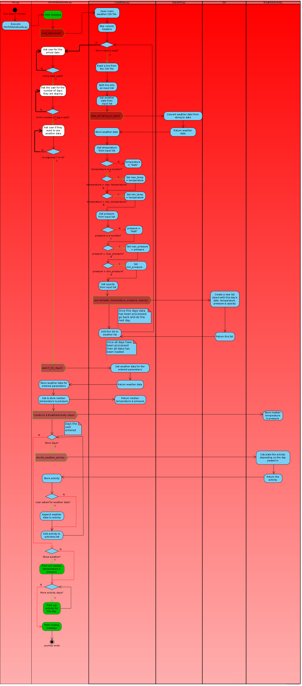

# Mostly Harmless

## Features
### Known Bugs
Sometimes the Mars Rover did not return any data for a particular day.  Thus there is no entry in the data for that day.  If a tourist enters a "missing day" as their arrival date, then a warning message is shown.  Otherwise the impact of missing some days in the dataset means that occassionally the output will contain skipped days, e.g. going from Saturday 8th September to Monday 10th September.

## Flow chart
### Key

|Type|Symbol|
| --- | --- |
|Input | |
|Output ||
|Process ||
|Code ||

Input :  
Output

##Validation
Source code was validated with [PEP8 Validator](http://pep8online.com/).
**run.py**

**HitchhikersGuide.py**

LoadData.py

**DateValidator.py**

**DateUtil.py**

Sol.py

**WeatherActivity.py**

## Data Coercion
1. **Atmospheric Opacity**
In the original dataset the Atmospheric Opacity was all set to "Sunny".  In order to provide meaningful searches that would return all of the different activities - every second Atmospheric Opacity reading was changed to "Cloudy"
2. **Date continuity**
There is a date gap where the second last date is '2012-08-15' and the last date is '2012-08-07' - a gap of one week.  The last record in the original data was removed in order to maintain a continuous set of readings.

## Credit

| Code purpose                    | Author               | Link                                                                               |
| ------------------------------- | -------------------- | ---------------------------------------------------------------------------------- |
| Validate a date string          | kite.com             | https://www.kite.com/python/answers/how-to-validate-a-date-string-format-in-python |
|                                 |                      |                                                                                    |
| Skip first line in a file       | kite.com             | https://www.kite.com/python/answers/how-to-skip-the-first-line-of-a-file-in-python |
| Format dates in Python          | Nicholas Samuel      | https://stackabuse.com/how-to-format-dates-in-python/                              |
| Python Errors                   | TutorialsTeacher.com | https://www.tutorialsteacher.com/python/error-types-in-python                      |
| Check if a string is an integer | Pratik Kinage        | https://www.pythonpool.com/python-check-if-string-is-integer/                      |
| Run a python file from another  | Delftstack           | https://www.delftstack.com/howto/python/python-run-another-python-script/          |
|How to colourise text in python|Stack Overflow |https://stackoverflow.com/questions/287871/how-to-print-colored-text-to-the-terminal|
