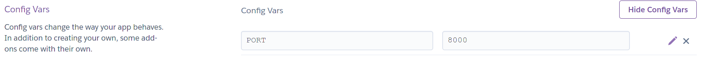

# Hitchhiker's guide to the Red Planet
## Overview
### Who is this app for?
This command line app is for all inter-galactic time-travelling tourists who wish to holiday on Mars at a specific date in the past.

### Where does the data come from?

This command line tool in python explores real-time data representing the weather conditions on Mars from Sol 1.  The data was measured and transmitted via the Rover Envionmental Monitoris Station (REMS) onboard the Curiosity Rover.  This data was made public by the NASA's Mars Science Laboratory and the Centro de Astrobiologia (CSIC-INTA).  
 
### What does it do?
 The environmental magnitudes given in this dataset are obtained from the values read by the Rover Environmental Monitoring Station (REMS) on board the Mars Science Laboratory (MSL) rover on mars.  This dataset provides the environmental magnitudes at REMS location, so MSL rover influences those magnitudes (rover position, rover temperature, rover orientation, rover shade, dust depositions on the rover, etc.)
 
This examines the data in a fictional response to creating a critical guide to hitch hiking on the Red Planet.  The aim is to interrogate the data and create the best possible outcomes to holidaying in Mars.  The reason this has been selected is to use something like NASA's data and interrogate the data set into meaningful information and creating actionable insights based upon this.
  
 It can be a minefield for people who struggle with the daily nuances of communication and need a reference and guide to navigate proper interpretation of the written and unspoken  word.  The aim is to evoke a neural response and consequently influence behaviour and outcome.
 
 ## How does it work
This a unique way of interpreting real world data using a command line interface in python.  This application will attempt to find out what holiday activities are best suited on the Red planet in a fictional sense.  It will give the applicable holiday activities for any given day according to the weather that is experienced on that particular day.  The aim is to interrogate the dataset and come up with the best laid plans for enjoying a holiday.  The simple command line interface is OS independent and not pertaining to any computer architectue and could be run in any environment. 

## Features
### Known Bugs
Sometimes the Mars Rover did not return any data for a particular day.  Thus there is no entry in the data for that day.  If a tourist enters a "missing day" as their arrival date, then a warning message is shown.  Otherwise the impact of missing some days in the dataset means that occassionally the output will contain skipped days, e.g. going from Saturday 8th September to Monday 10th September.

## Flow chart
### Key

|Type|Symbol|
| --- | --- |
|Input | |
|Output ||
|Process ||
|Code ||

Input :  
Output

## Design Decisions
### Data Coercion
1. **Atmospheric Opacity**
In the original dataset the Atmospheric Opacity was all set to "Sunny".  In order to provide meaningful searches that would return all of the different activities - every second Atmospheric Opacity reading was changed to "Cloudy"
2. **Date continuity**
There is a date gap where the second last date is '2012-08-15' and the last date is '2012-08-07' - a gap of one week.  The last record in the original data was removed in order to maintain a continuous set of readings.

### Colours
The [colorama](https://pypi.org/project/colorama/) python module was used to add some colour to the screen, and divide up the sections to make it easier to read.

### Usability
- **Suitability for purpose**
    - Hitchhikers Guide to the Red Planet provides textual information to the viewer.
    - The activities and weather information provided by Hithchikers Guide to the Red Planet is derived from the Mars weather dataset provided publicly by NASA.
    - The weather information is as accurate as the data provided in the Mars weather dataset.
- **Ease of use**
    - A simple easy-to-use application focusing on reducing the 'cognitive load' on viewers.  The system is designed so that the viewer does not have to remember large amounts of detail.
    - If a tourist makes and invalid input this is explained and they are given the chance to re-enter the input.
- **Information Display** 
    - The initial screen gives instructions on how to use the Hitchhikers Guide to the Red Planet.
    - Colours are used to divide the information into readable, distinguishable blocks.  This makes it easier for the tourist to glean information from the output they are presented with.
    - Invalid inputs are highlighted immediately and explained as to why they are invalid.

## Software Development Process
### Version Control 
**Git** is used for version control of this project
- Git commit message prefix convention denoting the type of change made in this commit:
    - DOC: Documentation
    - FEAT: Feature
    - FIX: Bugfix
    - STYLE: Changes to CSS
    - REFACTOR: Where changes are made that do not change the functionality.
- Git messages will be no longer than 50 characters long.

**GitHub** is used as the central version control repository for this project.

### Testing 
Testing is documented in the [Testing document](documentation/test/TESTING.md)

### Validation
Source code was validated with [PEP8 Validator](http://pep8online.com/).
**run.py**

**HitchhikersGuide.py**

**LoadData.py**

**DateValidator.py**

**DateUtil.py**

Sol.py

**WeatherActivity.py**

### Documentation  
- README.md :  Comprehensive overview of the Hitchhikers Guide to the Red planet application detailing how it works, what its features are, the technologies involved and all the design decisions that were made in creating this command line application.
- [Vision doc](documentation/requirements/vision-hitchhikers-guide-to-the-red-planet.docx) :  Business needs and feature list.
 

### Deployment
This project is deployed to [Heroku](https://hitchikers-guide-to-red-planet.herokuapp.com/)

1. Push the code to Github using `git push`.

2. Go to the Heroku Dashboard [Heroku Dashboard](https://dashboard.heroku.com/apps)

3. In the Heroku Dashboard, click on the *Create new app* button.

4. Enter an app name (*hitchikers-guide-to-red-planet*) and region (*Europe*) and click the *Create app* button.

5. Click on *Settings* tab

6. In the 'Config Vars' section, click on *Reveal Config Vars*.  Add a key of **PORT** and a value of **8000**.  Click *Add* button.

7. In the 'Build Packs' section, click on *Add Build Pack* button.  Select **Python**.  Click *Save Changes* button.

8. Click on *Add Build Pack* button again and select **nodejs**. Click *Save Changes* button.

9. Click on *Deploy* tab.

10. Choose Deployment Method *Github*.

11. In *Connect to Github* section, type **Hitchhiker** in the *repo-name* box and click *Search* button.

12. Click the *Connect* button next to **Liz-Conway/Project-3-Python**.

13. Heroku app is now connected to the Github repository.

14. Go to *Manual deploy* section, ensure the branch to deploy is **main**.  Click on *Deploy Branch* button.

15. Once the app is successfully deployed click on the *view* button, or navigate to [Hitchhikers Guide to the Red Planet](https://hitchikers-guide-to-red-planet.herokuapp.com/) to run the application.

16. Click on the RUN PROGRAM button to run the application.

17. Once the app has been deployed you can access it by navigating to [Hitchhikers Guide to the Red Planet](https://hitchikers-guide-to-red-planet.herokuapp.com/) to run the application.

## Credit

| Code purpose                    | Author               | Link                                                                               |
| ------------------------------- | -------------------- | ---------------------------------------------------------------------------------- |
| Validate a date string          | kite.com             | https://www.kite.com/python/answers/how-to-validate-a-date-string-format-in-python |
|                                 |                      |                                                                                    |
| Skip first line in a file       | kite.com             | https://www.kite.com/python/answers/how-to-skip-the-first-line-of-a-file-in-python |
| Format dates in Python          | Nicholas Samuel      | https://stackabuse.com/how-to-format-dates-in-python/                              |
| Python Errors                   | TutorialsTeacher.com | https://www.tutorialsteacher.com/python/error-types-in-python                      |
| Check if a string is an integer | Pratik Kinage        | https://www.pythonpool.com/python-check-if-string-is-integer/                      |
| Run a python file from another  | Delftstack           | https://www.delftstack.com/howto/python/python-run-another-python-script/          |
|How to colourise text in python|Stack Overflow |https://stackoverflow.com/questions/287871/how-to-print-colored-text-to-the-terminal|
