# Manual Testing
The following tests were carried out on the Hitchhiker's Guide to the Red Planet command line app.

## Valid data showing one date

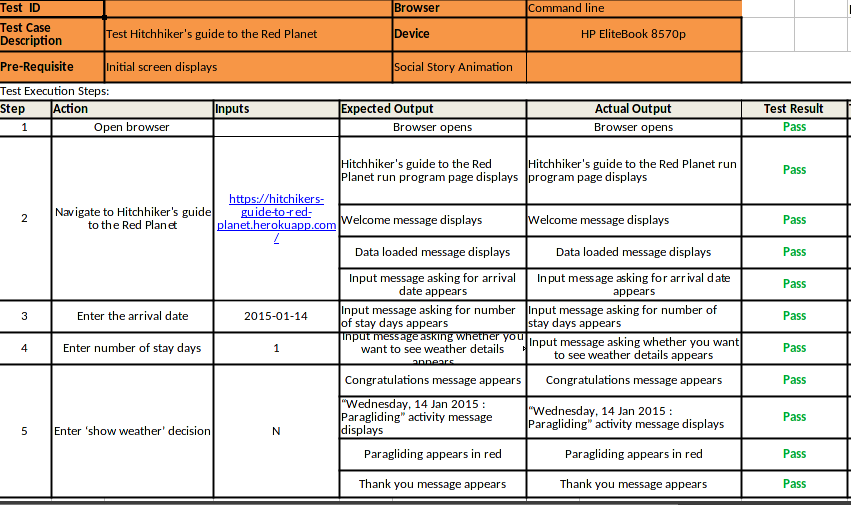

## Valid data showing multiple dates

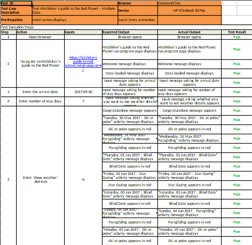

## Valid data showing one date & weather information

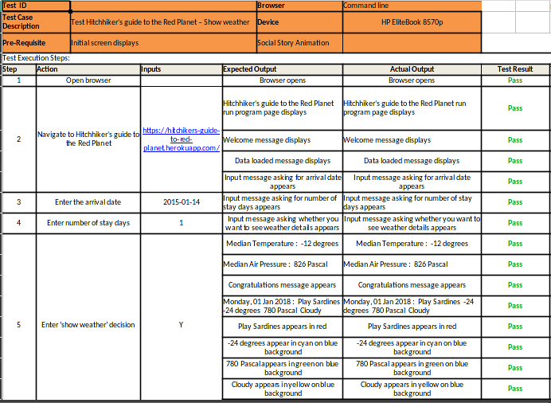

## Valid data showing multiple dates & weather information

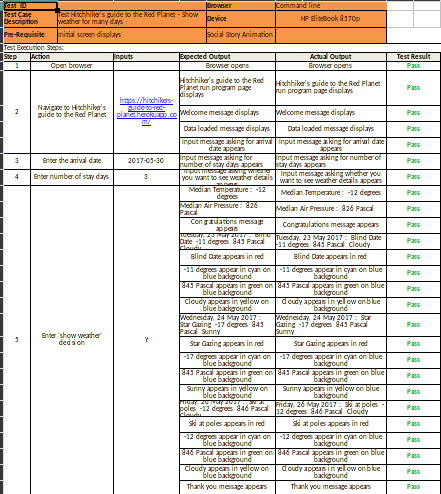

## Invalid Search date

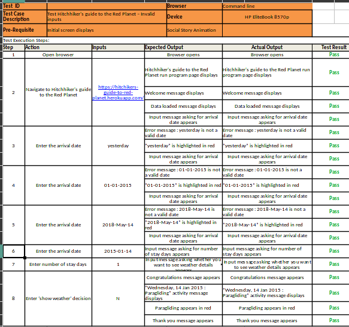

## Invalid stay duration

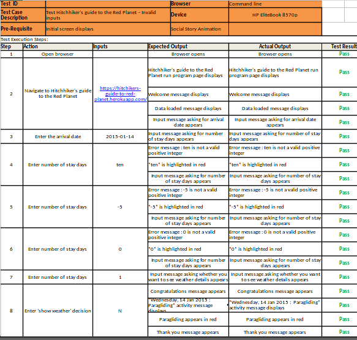

## Invalid show weather option

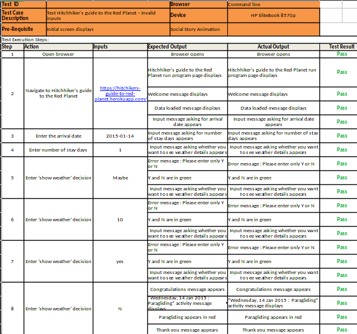

## Dataset contains NaN data for one date

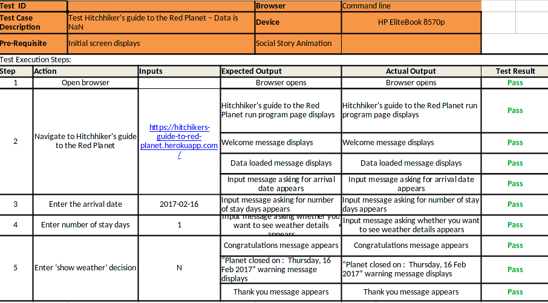

## Dataset contains NaN data for multiple dates

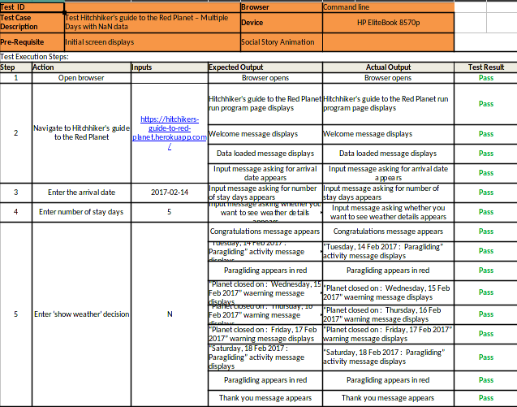

## Dataset does not contain input date

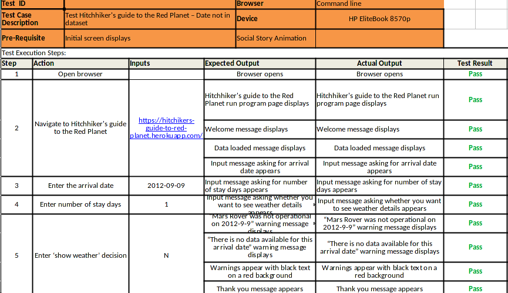

## Multiple dates spanning date that is not in dataset

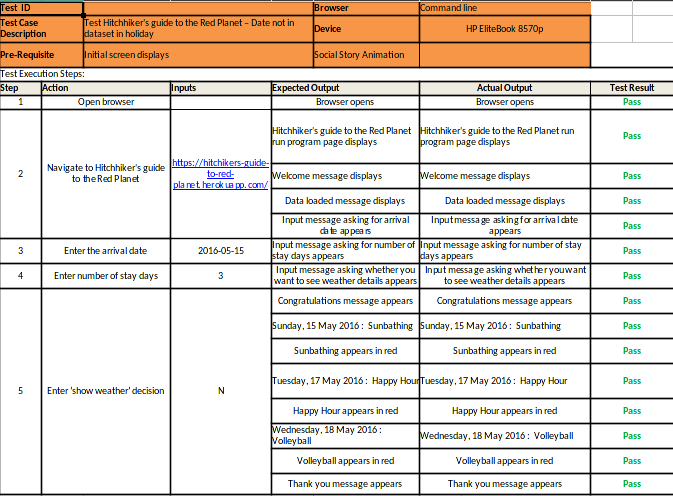
